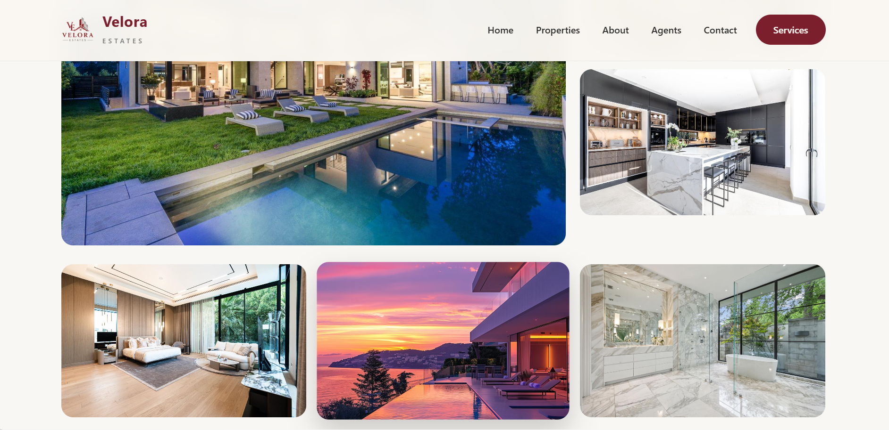

# Velora Estate | Luxury Real Estate Website

A modern, responsive luxury real estate website showcasing premium properties, trusted agents, and exceptional living experiences.

---

## 📖 Overview

Velora Estate is a premium frontend real estate website built to demonstrate modern UI/UX design, responsive layouts, and professional web development practices. The website allows visitors to browse luxury properties, learn about the company's services, meet experienced agents, and get in touch through a clean, intuitive interface.

---

## ✨ Features

- Modern and elegant homepage
- Fully responsive design
- Luxury property listings
- Property details page
- Professional agents section
- Real estate services
- Blog page
- Contact page
- Smooth navigation
- Mobile-friendly layout

---

## 🛠️ Technologies Used

- HTML5
- CSS3
- Bootstrap 5
- JavaScript

---

## 🚀 Live Demo

**Website:**  
https://velora-estate-phi.vercel.app/

---

## 📂 Project Structure

```text
velora-estate/
│
├── css/
├── images/
├── screenshots/
│   ├── homepage.png
│   ├── properties.png
│   ├── property-details.png
│   └── mobile-view.jpg
├── index.html
├── about.html
├── properties.html
├── detail.html
├── services.html
├── agents.html
├── blog.html
├── contact.html
└── README.md
```

---

## 📸 Screenshots

### Homepage


---

### Properties Page


---

### Property Details



---

### Mobile View


---

## 🚀 Future Improvements

- Advanced property search
- Property filtering
- Mortgage calculator
- Interactive Google Maps
- User authentication
- Property booking system
- Admin dashboard
- Backend integration with database

---

## 👨‍💻 Author

**Felix Nkanu**

- GitHub: https://github.com/Felix-Nkanu
- Portfolio: https://my-portfolio-website-psi-one.vercel.app/
- Email: felixnkanu636@gmail.com

---

## ⭐ Support

If you found this project helpful, consider giving it a ⭐ on GitHub.
